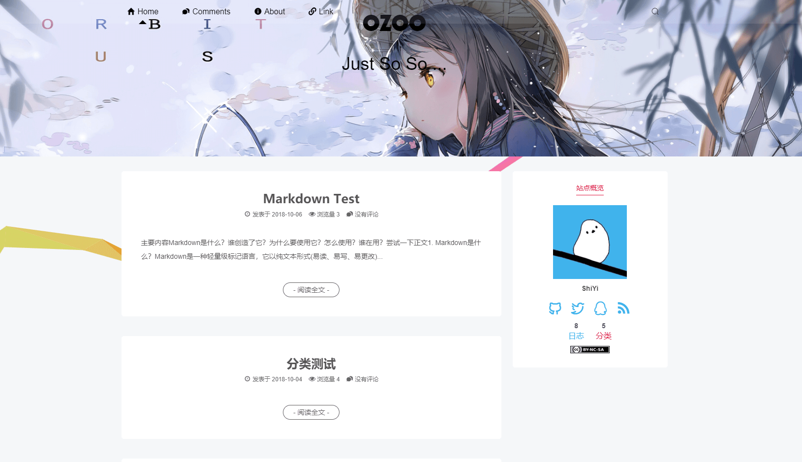

<h1 align="center">Sagiri</h1>
<h3 align="center">As lovely as sagiri</h3>

<p align="center">
  <a href="">Preview</a> |
  <a href="https://shiyiya.github.io/typecho-theme-sagiri">Documentation</a> |
  <a href="https://github.com/shiyiya/typecho-theme-sagiri/archive/master.zip">Download</a>
  <br />
  <br />
  <a href="https://github.com/shiyiya/typecho-theme-sagiri/tree/pjax">PJAX Version( donate )</a> |
  <a href="https://github.com/shiyiya/typecho-theme-sagiri/releases">Releases</a> |
  <a href="./doc/changelog.md">Change Log</a>
  <br />
  <br />
    <b>As lovely as sagiri, based on <a href="https://github.com/DIYgod/hexo-theme-sagiri">hexo-theme-sagiri</a></b>
</p>

[](https://github.com/shiyiya/typecho-theme-sagiri/blob/master/LICENSE) [](https://github.com/shiyiya/typecho-theme-sagiri#Donate)

## Demo



There must be no plagiarism or excessive reprinting; at least not a few months can not be accessed & change the theme, and that's it!
If you think you meet the above conditions, please submit the relevant `PR` ([How to PR](#Contribute))

- https://blog.imlazy.ink:233
- https://mianao.info
- ···

## Installation

1. Download & git clone from GitHub to your blog's theme folder.
2. Enable it in the background management, if an error occurs, rename the folder to sagiri

- If you need to update the theme, download the latest version, then overwrite the original file to complete the update, some new features need to be enabled in the background to take effect.

```shell
git clone https://github.com/shiyiya/typecho-theme-sagiri.git
```

## Features

### Rich Code Highlight Theme Choices

Using Prism.js as code highlighting. sagiri default comes with 5 themes & supported 32 language, if you need more, just go [here](https://prismjs.com/) to download.

- Supported language: markup+css+clike+javascript+c+csharp+cpp+ruby+docker+markup-templating+flow+git+go+haskell+java+json+kotlin+markdown+lisp+lua+php+sql+powershell+python+typescript+rust+scala+scheme+pug+swift+yaml+vi

<table>
  <tr>
    <td></td>
    <td></td>
    <td></td>
  </tr>
</table>

### Special Page

- Create Page.

  <tr>
     <td></td>
     <td></td>
   </tr>

- Select the corresponding template and fill in the correct path

<table>
  <tr>
     <td></td>
     <td></td>
     <td></td>
     <td></td>
  </tr>
  <tr>
     <td><b>search.html</b></td>
     <td><b>Without restriction</b></td>
     <td><b>archive.html</b></td>
     <td><b>category.html</b></td>
   </tr>
</table>

- Tencent Group: [861379856](https://jq.qq.com/?_wv=1027&k=5kACJ6v)

### Multi-language Support

- Need more language support, Welcome contribution. ([How to PR](#Contribute))

### Lazy load Image

```markdown


//example

```

## Others Setting

- Index Post Card
  Home Article Overview The default maximum output is **150** characters, you can manually add the truncation `<!-- more -->` control output.

- Article thumbnail
  weight of the thumbnail: Article field -> The first Upload Image of Article -> Image link in the article -> Random Image

- ...

## Link

Create a template before this, the content format is as follows

```markdown
- [href descript](href)<hr> descript
- [title](href) <hr> descript
- [title](href)
```

## Header Menu Icon

- Home <-> 主页
- Comments <-> 留言
- About <-> 关于
- Link <-> 友链
- Time

## BackUp

```sql
-- postview(mysql)
ALTER TABLE `typecho_contents` ADD `views` INT(10) NULL DEFAULT '0' AFTER `parent`;

-- siteview(mysql)

```

## Comment Emoji

How to import custom Emoji ?

- [OwO](https://github.com/DIYgod/OwO)
- [Emjio Util](./util/emjioUtil.min.js)

## Author

**typecho-theme-sagiri** © [shiyi](https://github.com/shiyiya), Released under the [GPL-3.0](./LICENSE) License.<br>
Authored and maintained by DIYgod with help from contributors ([list](https://github.com/shiyiya/typecho-theme-sagiri/contributors)).

> Blog [@OZOO](http://www.runtua.cn) · GitHub [@shiyi](https://github.com/shiyiya) · Twitter [@shiyi](https://twitter.com/)

## Donate

- [Donate via Paypal](https://paypal.me/)
- [Donate via WeChat Pay](https://i.loli.net/2019/10/27/n5fAVZyRlN63EH4.png)
- [Donate via Alipay]()

## Contribute

If you feel like to help us build a better Sagiri, you can

Write a plugin | Submit a tutorial | Report a bug | Add a translation

## License

Open sourced under the GPL V3.0 license.
